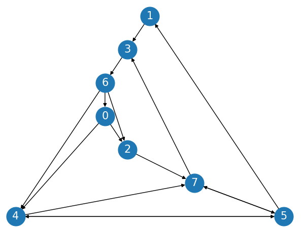

# Graphs and digraphs with modern C++

## General
- Code for weighted and unweighted graph and digraph problems
- No usage of owning raw pointers, `new` etc. (uses `std::unique_ptr`, `std::vector`, ... instead)
- Unit tests in `test/` subdirectories
- This is a sample project and not a huge library. It is currently not split in headers and implementations.

## General headers (`general/`)

### `include/`
- `DisjointSets` as an efficient union-find data structure with path compression and union-by-rank (see also [here](https://www.xeve.de/wp/2021/01/efficient-union-find-in-cpp-or-disjoint-set-forests-with-path-compression-and-ranks/))
- `IndexedPriorityQueue` as a priority queue which supports changing keys in logarithmic time (see [here](https://www.xeve.de/wp/2021/01/indexed-priority-queue-in-cpp/)), and `PriorityQueue` as a simpler version which does not

## Unweighted graphs (`unweighted_graph/`)

### `include/`
- Simple (undirected) `Graph` interface
- `AdjacencyListGraph` (https://en.wikipedia.org/wiki/Adjacency_list)
- Basic utility functions (a few)
- Find paths starting at a vortex to all connected vertices
  - with [Depth-first Search (DFS)](https://en.wikipedia.org/wiki/Depth-first_search) recursively (`graph::find_paths_to_all::fromVertexToAllDfs`)
  - with DFS iteratively (`graph::find_paths_to_all::fromVertexToAllDfsNoRec`)
  - with [Breadth-first Search (BFS)](https://en.wikipedia.org/wiki/Breadth-first_search) iteratively (`graph::find_paths_to_all::fromVertexToAllBfs`)
- Find connected components (https://en.wikipedia.org/wiki/Component_(graph_theory)) with DFS (`graph::ConnectedComponents`)
- Check whether a graph is [bipartite](https://en.wikipedia.org/wiki/Bipartite_graph) with DFS (`graph::isBipartite`)

### `unweighted_graph_demo.cpp`
- Basic test of `Graph.h` functionality
- Reads graphs from standard input (`build/unweighted_graph/unweighted_graph_demo < tinyG.txt`) or file given as program argument (`build/unweighted_graph/unweighted_graph_demo tinyG.txt`) 
- Sample graph from `tinyG.txt`:
  

## Unweighted digraphs (`unweighted_digraph/`)

### `include/`
- Simple `Digraph` interface
- `AdjacencyListDigraph` (https://en.wikipedia.org/wiki/Adjacency_list)
- check for cycles
- determine topological sort (https://en.wikipedia.org/wiki/Topological_sorting)
- determine strongly-connected components with Kosaraju-Sharir algorithm (https://en.wikipedia.org/wiki/Kosaraju%27s_algorithm)

### `unweighted_digraph_demo.cpp`
- Basic test of `Digraph.h` functionality
- Reads digraph from standard input (`build/unweighted_digraph/unweighted_digraph_demo < tinyDG.txt`) or file given as program argument (`build/unweighted_digraph/unweighted_digraph_demo tinyDG.txt`)
- Sample digraph from `tinyDG.txt`:

  

## Weighted graphs (`weighted_graph/`)

### `include/`
- `EdgeWeightedGraph` interface and an implementation with adjacency lists
- [Minimum Spanning Tree](https://en.wikipedia.org/wiki/Minimum_spanning_tree) identification with [Kruskal's algorithm](https://en.wikipedia.org/wiki/Kruskal%27s_algorithm)

### `weighted_graph_demo.cpp`
- Reads a weighted graph from standard input or a file given as program argument
- Prints the graph's edges and the Minimum Spanning Tree edges
- Sample edge-weighted graph from `tinyEWG.txt` and its Minimum Spanning Tree:

  

## Weighted digraphs (`weighted_digraph/`)

### `include/`
- `EdgeWeightedDigraph` interface and an implementation with adjacency lists
- `SingleSourceShortestPath` as an interface for finding shortest paths to all other nodes starting at a start vertex:
  - `SingleSourceDijkstraShortestPath` as an implementation of [Dijkstra's algorithm](https://en.wikipedia.org/wiki/Dijkstra%27s_algorithm) for all weighted digraphs without negative edge weights
  - `SingleSourceAcyclicShortestPath` for acyclic weighted digraphs - uses the topological order

### `weighted_digraph_demo.cpp`
- Reads a weighted digraph from standard input or a file given as program argument
- Determines the shortest paths starting at vertex 0 with Dijkstra's algorithm and prints the results
- Sample edge-weighted digraph from `tinyEWD.txt` (without showing weights):

  
  
- Sample edge-weighted **acyclic** digraph from `tinyEWDAG.txt` (without showing weights):

  


## Compilation and execution
- Download submodules (for unit tests): `git submodule update --init --recursive`
- Compile with `cmake`:
  ```bash
  mkdir build
  cd build/
  cmake ..
  make
  ```
- Go to top-level folder again: `cd ..`
- Run all tests: `find build/ -name "*_gtest" -exec {} \;`
- Run demos:
  - `build/unweighted_graph/unweighted_graph_demo tinyG.txt`
  - `build/unweighted_digraph/unweighted_digraph_demo tinyDG.txt`
  - `build/weighted_graph/weighted_graph_demo tinyEWG.txt`
  - `build/weighted_digraph/weighted_digraph_demo tinyEWD.txt`
  - `build/weighted_digraph/weighted_digraph_demo tinyEWDAG.txt`

## References
- Introduction to Algorithms by Cormen et al.
- Algorithms, [Part II](https://www.coursera.org/learn/algorithms-part2/home/welcome) by Princeton University (Robert Sedgewick, Kevin Wayne)
